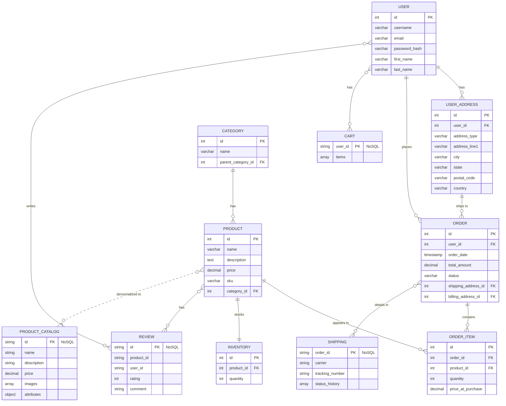

# E-commerce Database Schema Diagram

This diagram illustrates the relationships between the SQL tables in the e-commerce database.

```mermaid
erDiagram
    USER ||--o{ USER_ADDRESS : "has"
    USER ||--o{ ORDER : "places"
    ORDER ||--o{ ORDER_ITEM : "contains"
    PRODUCT ||--o{ ORDER_ITEM : "appears in"
    CATEGORY ||--o{ PRODUCT : "has"
    PRODUCT ||--|| INVENTORY : "stocks"
    USER_ADDRESS ||--o{ ORDER : "ships to"

    USER }o--o{ CART : "has"
    PRODUCT }o--o{ REVIEW : "has"
    USER }o--o{ REVIEW : "writes"
    ORDER }o--o{ SHIPPING : "details in"
    PRODUCT }o..o{ PRODUCT_CATALOG : "denormalized to"

    USER {
        int id PK
        varchar username
        varchar email
        varchar password_hash
        varchar first_name
        varchar last_name
    }

    USER_ADDRESS {
        int id PK
        int user_id FK
        varchar address_type
        varchar address_line1
        varchar city
        varchar state
        varchar postal_code
        varchar country
    }

    ORDER {
        int id PK
        int user_id FK
        timestamp order_date
        decimal total_amount
        varchar status
        int shipping_address_id FK
        int billing_address_id FK
    }

    ORDER_ITEM {
        int id PK
        int order_id FK
        int product_id FK
        int quantity
        decimal price_at_purchase
    }

    PRODUCT {
        int id PK
        varchar name
        text description
        decimal price
        varchar sku
        int category_id FK
    }

    CATEGORY {
        int id PK
        varchar name
        int parent_category_id FK
    }

    INVENTORY {
        int id PK
        int product_id FK
        int quantity
    }

    PRODUCT_CATALOG {
        string id PK "NoSQL"
        string name
        string description
        decimal price
        array images
        object attributes
    }

    CART {
        string user_id PK "NoSQL"
        array items
    }

    REVIEW {
        string id PK "NoSQL"
        string product_id
        string user_id
        int rating
        string comment
    }

    SHIPPING {
        string order_id PK "NoSQL"
        string carrier
        string tracking_number
        array status_history
    }
```
